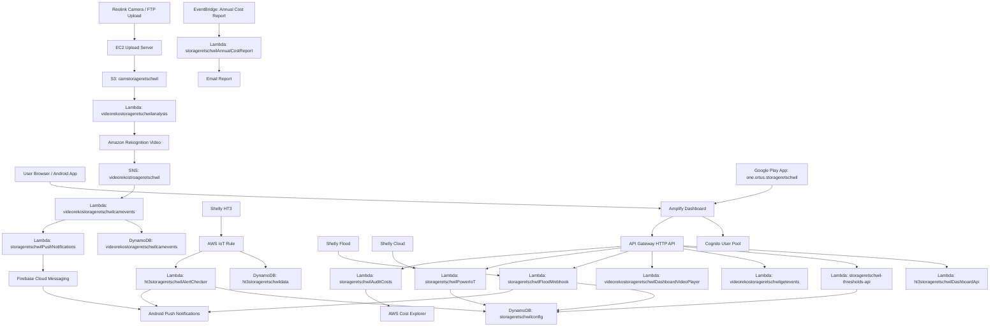

# Storage Retschwil Architecture

## Overview

Storage Retschwil combines an Amplify-hosted dashboard with AWS APIs, DynamoDB state, S3 camera videos, Rekognition label detection, Shelly Cloud device controls, Firebase Cloud Messaging app notifications, and a Google Play distributed Android app.

## Main Data Flows

### Measurements

1. Shelly HT3 publishes temperature and humidity.
2. AWS IoT rule stores the data in DynamoDB.
3. Alert checker evaluates thresholds and device status.
4. Dashboard reads current and historical values through API Gateway.
5. HT3 is mains-powered; device status and alerts use external-power connectivity and no longer evaluate a battery percentage.

### Flood

1. Shelly Flood calls the webhook Lambda.
2. Lambda stores flood and cable status.
3. Dashboard reads status through API Gateway.
4. Android app alerts are sent when configured alert conditions are met and the flood alert state changed since the last notification.

### Video Detection

1. Camera uploads videos through passive FTP to the `t3.micro` EC2 upload server.
2. A locked one-at-a-time sync copies videos to S3 and removes local files only after a successful sync.
3. S3 upload starts Rekognition analysis.
4. Rekognition completion is delivered through SNS.
5. Event processor stores labels and sends Android push alerts.
6. Dashboard shows all available detection records until the related video expires.

### Power And Dehumidifier

1. Dashboard calls the PowerIoT API once for both Shelly devices every 15 seconds.
2. Lambda uses one batched Shelly Cloud v2 status request to remain below the one-request-per-second cloud limit.
3. Lambda sends switch commands to Shelly Cloud. Switching Power IoT off includes a device-side 30-second flip-back timer.
4. Dashboard displays that timer inside the Power IoT button.
5. Dashboard infers the dehumidifier state from the positive PlugS reading: above 200 W is ON and below 100 W is OFF.

### Costs

1. Dashboard calls the Audit Costs API.
2. Lambda reads AWS Cost Explorer with a Storage Retschwil service-scope filter.
3. Lambda combines scoped AWS cost data with energy cost estimates.
4. Annual report Lambda sends a yearly email on January 1.

## Boundaries

- AWS is the system of record for dashboard backend state.
- Shelly Cloud is the source of live power and switch control data.
- Android push notifications are the only active alert delivery channel.
- Android push notifications use Firebase Cloud Messaging data payloads; the installed app renders the notification locally so notification taps open the app.
- Invalid FCM registration tokens are removed automatically after Firebase reports them as unregistered.
- Google Play is the distribution channel for the Android app package `one.ortus.storageretschwil`.
- Existing legacy resource names should not be renamed without a planned migration.
